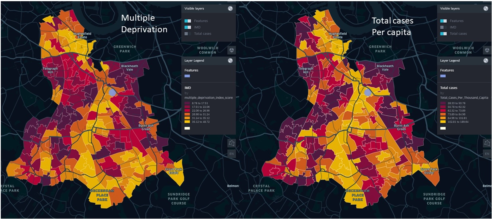
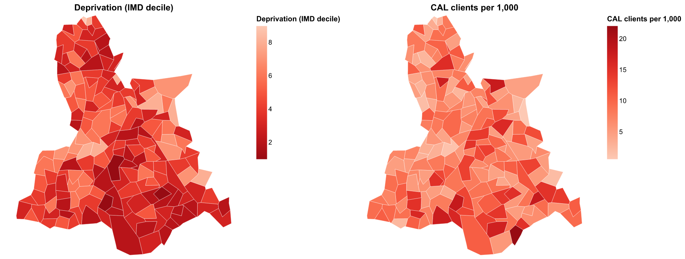
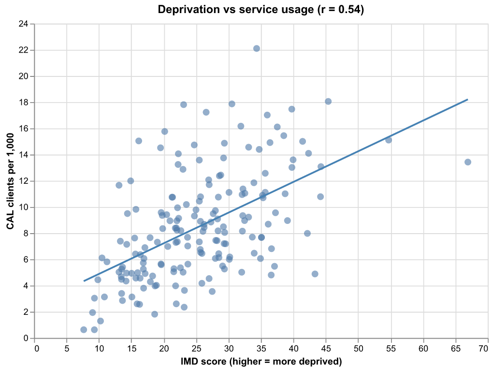

# CAL Vulnerable Client Analysis

**Reference article:** [DataKind UK - Citizens Advice Lewisham](https://www.datakind.org.uk/stories-news/citizens-advice-lewisham)

**More about what Citizens Advice Lewisham is doing:** [Citizens Advice Lewisham](https://citizensadvicelewisham.org.uk/)

## Problem Statement

Citizens Advice Lewisham (CAL) needed to identify 'vulnerability hotspots' - areas with high need but limited access to resources - to optimize service delivery.

**Key objectives:**
- Map vulnerability hotspots in Lewisham
- Optimize service delivery based on geographic need
- Validate service targeting effectiveness

## Dataset Involved

**CAL Vulnerability Framework**: Internal assessment of service users' ability to cope with life changes, based on factors like low income, housing, mental health, and disability.

**Index of Multiple Deprivation (IMD)**: Government dataset measuring seven deprivation domains (income, employment, crime, etc.) mapped to Lower Layer Super Output Areas (LSOAs) - geographic units of ~1,500 people each.

## Desired Output

**Deprivation Map**: Visual representation showing LSOAs colored by deprivation level (red = least deprived, yellow = most deprived), revealing higher deprivation in southern borough areas.

**Service Usage Map**: Geographic distribution of CAL clients per capita, with color coding indicating service demand (yellow = high usage, red = low usage).

**Key Finding**: Strong correlation between deprivation levels and service usage - areas with highest deprivation scores also showed highest client volumes, validating CAL's service targeting.


*Figure 1: Geographic distribution of CAL clients per capita across Lewisham LSOAs and IMD scores*

## Replicating the Output with KindTech

### Data Requirements

**Internal Dataset:**
- Individual client records with vulnerability factor scores
- Postcode data for geographic mapping
- Goal: Map postcodes to LSOAs to calculate clients per capita

**External Datasets:**
- **Index of Multiple Deprivation (IMD)**: LSOA-level deprivation scores for overlay analysis
- **Census Data**: Population figures for per-capita calculations
- **LSOA Boundaries**: Geographic polygons for spatial analysis and mapping

### Analysis Workflow

1. **Data Preparation**: Convert postcodes to LSOA codes using geographic lookup
2. **Aggregation**: Calculate total clients per LSOA
3. **Normalization**: Compute clients per capita using census population data
4. **Spatial Analysis**: Overlay client density with IMD scores
5. **Visualization**: Create comparative maps showing deprivation vs. service usage

### Reproduction

A runnable, end-to-end reproduction lives in
[`examples/cal_vulnerable_client.py`](https://github.com/KindTechUK/kindtech/blob/main/examples/cal_vulnerable_client.py)
(a [marimo](https://marimo.io/) notebook). It chains three KindTech connectors,
all joining on the 2021 LSOA `geography_code`:

[](https://molab.marimo.io/github/KindTechUK/kindtech/blob/main/examples/cal_vulnerable_client.py)
&nbsp;— run it live in the browser (the molab cloud runtime fetches real ONS
data), or locally with `uv run marimo edit examples/cal_vulnerable_client.py`.

```python
from kindtech import postcodes_to_geography, load_imd, load_geodata

# 1. Client postcodes -> LSOA (the step real client data would use)
clients = postcodes_to_geography(client_postcodes, geography_type="LSOA")

# 2. Deprivation + population per LSOA (IoD 2025, on 2021 LSOAs)
imd = load_imd(nation="England")  # imd_decile, imd_score, population
```

!!! note "Everything is on 2021 LSOAs — no crosswalk"
    The postcode connector returns 2021 LSOA codes, **IMD 2025** is published on
    2021 LSOAs (and ships a population denominator), and the default LSOA
    boundaries are 2021. So deprivation, population and client geography line up
    on one `geography_code` with no vintage conversion. (The older composite
    `load_imd(year=2019)` is on 2011 LSOAs and would need a crosswalk.)

Client records are private, so the notebook generates synthetic clients per
LSOA at a rate that **rises with deprivation**, then normalises to clients per
1,000 residents.

**Hotspots vs usage** — deprivation (left) and CAL client rate (right). Shared
dark areas mean clients come from the most-deprived LSOAs:


*Figure 2: IMD 2025 decile (left, dark = most deprived) vs synthetic CAL clients
per 1,000 residents (right). The hotspots align.*

**Does usage track deprivation?** Each LSOA's deprivation score against its
client rate:


*Figure 3: A clear positive correlation between deprivation and clients per
capita — the direction the original study found, validating CAL's targeting.*

To run on real data, feed the real client postcodes through step 1 and
aggregate per `geography_code`; the IMD join, per-capita maths and maps are
unchanged.

## Lessons Learned

**Key takeaways and recommendations:**

- **Geographic targeting works**: The strong correlation between deprivation and service usage validates CAL's approach to targeting high-need areas
- **Data integration is crucial**: Combining internal service data with external deprivation indices provides powerful insights
- **Visualization drives action**: Clear maps help stakeholders understand and act on the findings
- **Per-capita analysis matters**: Normalizing by population reveals true service demand patterns
- **LSOA-level granularity is appropriate**: Geographic units of ~1,500 people provide sufficient detail without compromising privacy
