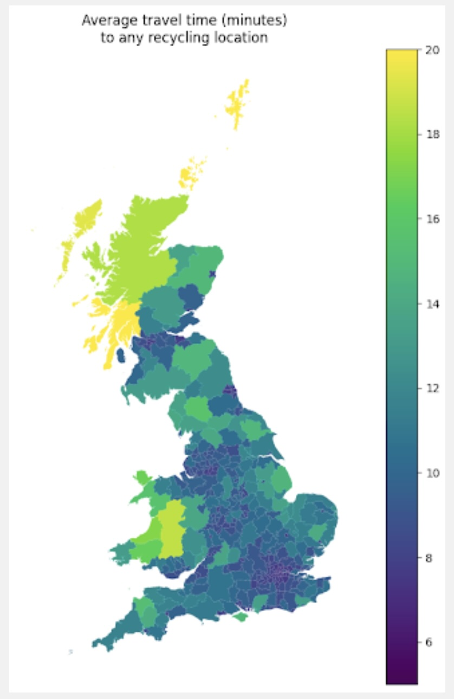

# Material Focus Recycling Analysis

**Reference article:** [DataKind UK - Material Focus Recycling](https://www.datakind.org.uk/stories-news/material-focus)

**More about what Material Focus Recycling is doing:** [Material Focus Recycling](https://www.materialfocus.org.uk/)

## Problem Statement

Material Focus needed to gather evidence to demonstrate to stakeholders what interventions would make the greatest difference in increasing electrical item recycling rates across the UK.

**Key Research Questions**:
- Where in the UK could Material Focus achieve the greatest impact if small electricals were recycled through major supermarkets?
- Do factors like proximity to collection points influence recycling rates in different areas?
- What barriers prevent individuals from recycling electrical goods?

**Objective**: To identify optimal locations for new collection points and understand the factors that influence recycling behavior, enabling Material Focus to encourage local authorities to fund additional infrastructure.

## Dataset Involved

**Internal Data**:
- Existing recycling rates for electronic goods and general recycling
- Location of current recycling points across the UK
- Travel times from residential areas to nearest recycling facilities

**External Data**:
- Population density by geographic area
- Car ownership rates
- Housing types and demographics
- Other relevant socioeconomic variables

## Desired Output

**Travel Time Visualization**: A comprehensive map showing average travel time in minutes to any recycling location across England, with travel times ranging from a maximum of 20 minutes to under six minutes.

**Key Finding**: The visualization revealed that a significant proportion of people across England have access to recycling points within 12 minutes of travel time, indicating good baseline infrastructure coverage.

**Behavioral Analysis**: Material Focus was particularly interested in understanding what factors would influence new individuals to start recycling—not just optimizing for people already engaged in recycling. The analysis examined:
- Travel distance to recycling facilities
- Population density compared to recycling participation rates
- Availability of kerbside collection services

*Figure 1: Average travel time in minutes to any recycling location for people living in the area, moving from a maximum of 20 minutes to under six minutes.*

## Replicating the Output with KindTech

### Analysis Workflow

1. Generate the recycling rate data at local authority level
2. Combine with LAD boundary data to create a map of the UK

Or

1. Locate the recycling points and generate average travel time to the nearest recycling point within LAD
2. Combine with LAD boundary data to create a map of the UK

## Lessons Learned

Key takeaways and recommendations.
