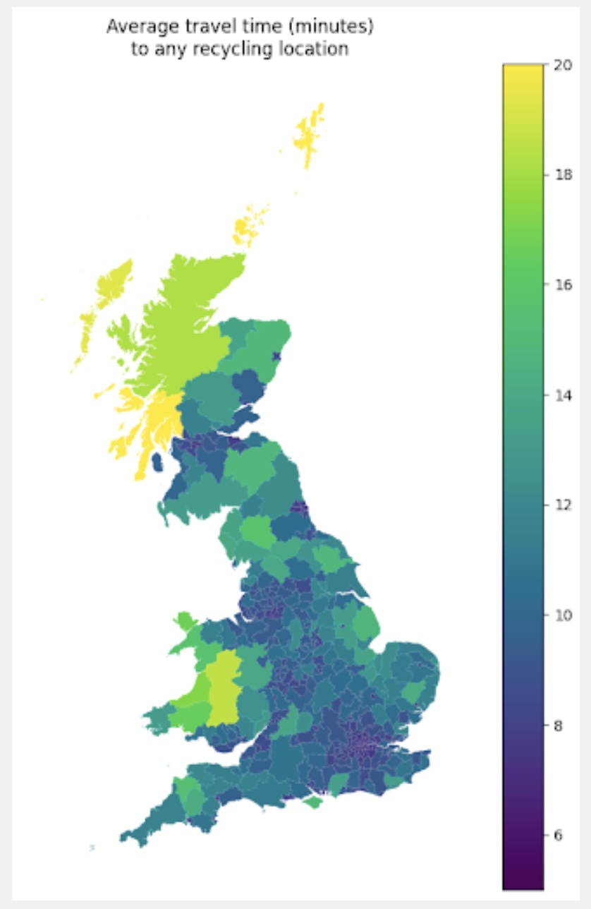
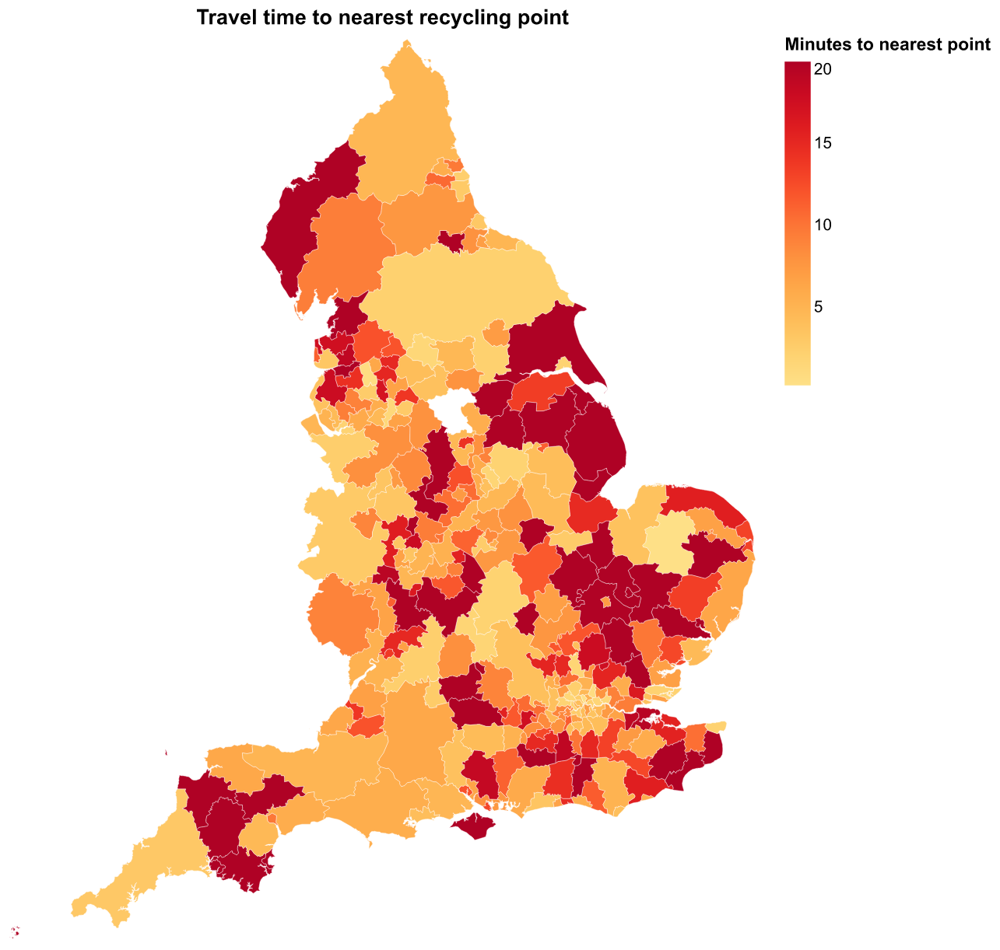
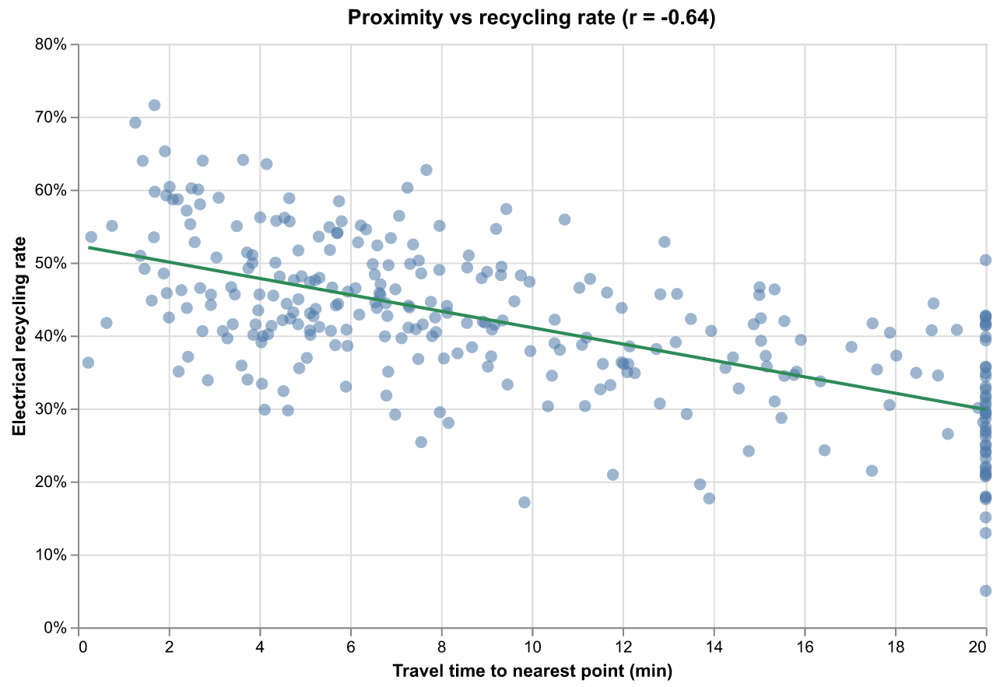

# Material Focus Recycling Analysis

**Reference article:** [DataKind UK - Material Focus Recycling](https://www.datakind.org.uk/stories-news/material-focus)

**More about what Material Focus Recycling is doing:** [Material Focus Recycling](https://www.materialfocus.org.uk/)

## Problem Statement

Material Focus needed to gather evidence to demonstrate to stakeholders what interventions would make the greatest difference in increasing electrical item recycling rates across the UK.

**Key Research Questions**:
- Where in the UK could Material Focus achieve the greatest impact if small electricals were recycled through major supermarkets?
- Do factors like proximity to collection points influence recycling rates in different areas?
- What barriers prevent individuals from recycling electrical goods?

**Objective**: To identify optimal locations for new collection points and understand the factors that influence recycling behavior, enabling Material Focus to encourage local authorities to fund additional infrastructure.

## Dataset Involved

**Internal Data**:
- Existing recycling rates for electronic goods and general recycling
- Location of current recycling points across the UK
- Travel times from residential areas to nearest recycling facilities

**External Data**:
- Population density by geographic area
- Car ownership rates
- Housing types and demographics
- Other relevant socioeconomic variables

## Desired Output

**Travel Time Visualization**: A comprehensive map showing average travel time in minutes to any recycling location across England, with travel times ranging from a maximum of 20 minutes to under six minutes.

**Key Finding**: The visualization revealed that a significant proportion of people across England have access to recycling points within 12 minutes of travel time, indicating good baseline infrastructure coverage.

**Behavioral Analysis**: Material Focus was particularly interested in understanding what factors would influence new individuals to start recycling—not just optimizing for people already engaged in recycling. The analysis examined:
- Travel distance to recycling facilities
- Population density compared to recycling participation rates
- Availability of kerbside collection services


*Figure 1: Average travel time in minutes to any recycling location for people living in the area, moving from a maximum of 20 minutes to under six minutes.*

## Replicating the Output with KindTech

### Analysis Workflow

1. Generate the recycling rate data at local authority level
2. Combine with LAD boundary data to create a map of the UK

Or

1. Locate the recycling points and generate average travel time to the nearest recycling point within LAD
2. Combine with LAD boundary data to create a map of the UK

### Reproduction

A runnable, end-to-end reproduction lives in
[`examples/material_focus_recycling.py`](https://github.com/KindTechUK/kindtech/blob/main/examples/material_focus_recycling.py)
(a [marimo](https://marimo.io/) notebook). It builds the headline travel-time
map from two KindTech connectors, joining on `geography_code`:

[](https://molab.marimo.io/github/KindTechUK/kindtech/blob/main/examples/material_focus_recycling.py)
&nbsp;— run it live in the browser (the molab cloud runtime fetches real ONS
data), or locally with `uv run marimo edit examples/material_focus_recycling.py`.

```python
from kindtech import load_geodata, geodata_to_properties, load_ons
import pandas as pd

# LAD boundaries carry LAT/LONG centroids
geojson = load_geodata(geography_type="LAD", year="2025", boundary_type="BUC")
geo = pd.DataFrame(geodata_to_properties(geojson, "LAD", 2025))

# Total population per LAD — so the headline is people-weighted, not area-weighted
pop = load_ons("population", geography_type="LAD", time="latest",
               measures=20100, gender=0, c_age=200)
```

The real collection-point list isn't public, so the notebook scatters 300
synthetic points *where people live* (supermarket take-back follows population)
and measures the straight-line distance from each LAD centroid to the nearest
one.

!!! warning "Straight-line distance, not road routing"
    The original mapped **road travel time**. This reproduction approximates it
    with **haversine** distance converted to minutes at an effective 40 km/h,
    capped at 20 minutes. That reproduces the *pattern* and the headline
    statistic well, but it is not a true drive-time. A faithful road travel-time
    map needs a **routing engine** (e.g. [OSRM](https://project-osrm.org/) or
    [OpenRouteService](https://openrouteservice.org/)); KindTech does not wrap
    one yet. If more case studies need real travel time, a small `kindtech`
    routing connector would be worth adding.

**Travel-time map** — minutes to the nearest recycling point per LAD:


*Figure 2: Approximate travel time (minutes) to the nearest recycling point.
~76% of people are within a 12-minute trip, with a long tail of harder-to-reach
rural authorities (dark) — candidates for new collection points.*

**Does proximity influence recycling?** Each LAD's travel time against a
synthetic participation rate:


*Figure 3: A real-but-loose downward trend — recycling falls as travel time
rises, the direction Material Focus argued, with proximity one driver among
several (car ownership, kerbside collection, demographics).*

To run on real data, swap the synthetic points for Material Focus's actual
collection-point coordinates and the synthetic rate for measured participation;
the population join and maps are unchanged.

## Lessons Learned

**Key takeaways and recommendations:**

- **People-weighting matters**: averaging travel time per area over-counts large
  rural authorities. Weighting by population reproduces the people-based
  headline ("most within 12 minutes") that an unweighted map would miss.
- **Distance is a first-order proxy, routing is the refinement**: straight-line
  distance gets the pattern and the access statistic right cheaply; a routing
  engine is only needed when the literal drive-time figure is the deliverable.
- **Maps turn coverage into targets**: ranking authorities by travel time points
  directly at where a new collection point cuts the longest trips — the evidence
  the campaign needed to lobby local authorities.
- **Composable connectors**: boundaries + population join on `geography_code`
  with no glue code, so the same workflow extends to car ownership, housing type
  or deprivation as further explanatory factors.
