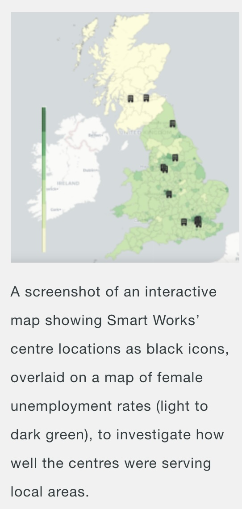

# Smart Works Woman Unemployment Analysis

**Reference article:** [DataKind UK - Smart Works](https://www.datakind.org.uk/stories-news/smart-works)

**More about what Smart Works is doing:** [Smart Works](https://www.smartworks.org.uk/)

## Problem Statement

Smart Works needed to identify gaps in their service provision and optimize their outreach strategy to reach more unemployed women who could benefit from their support.

**Key Challenge**: With over 632,500 unemployed women in their operating areas, Smart Works was not reaching all potential beneficiaries and struggled to identify service gaps.

**Key objectives:**
- Map the distribution of Smart Works clients across Local Authorities
- Identify areas with high unemployment but low client numbers
- Analyze demographic disparities between clients and national unemployment data
- Optimize outreach strategy and inform future center locations

**Research Questions:**
- Which Local Authorities have high unemployment rates but low Smart Works client numbers?
- Are there specific demographic groups (age, ethnicity) that Smart Works is under-serving?
- Where should Smart Works focus their efforts or consider opening new centers?
- How do Smart Works client demographics compare to national unemployment patterns?

## Dataset Involved

**Primary Data Sources**:
- **Census 2021**: Comprehensive demographic and employment data by Local Authority
- **Annual Population Survey**: Current unemployment statistics and trends
- **Smart Works Internal Data**: Client records with geographic and demographic information

**Data Integration**: Publicly available 'open data' from Census 2021 and Annual Population Survey was mapped to show women's unemployment rates by Local Authority and compared to Smart Works client distribution.

**Analysis Scope**:
- Geographic comparison of unemployment rates vs. client numbers
- Demographic analysis comparing Smart Works clients to overall unemployed women population

## Desired Output

*Figure 1: Geographic distribution of Smart Works clients compared to unemployment rates across Local Authorities*

**Key Findings:**

- **Service Gaps Identified**: Several Local Authorities with high unemployment rates showed low numbers of existing Smart Works clients
- **Demographic Disparity**: High unemployment among young women, who appear to be under-served by Smart Works
- **Strategic Opportunities**: Clear geographic areas where Smart Works could expand their reach
- **Outreach Optimization**: Evidence-based guidance for future center locations and targeted outreach

## Replicating the Output with KindTech

### Data Requirements

**Internal Dataset**: Smart Works client records with:
- Geographic location (Local Authority)
- Demographic information (age, ethnicity)
- Service usage patterns

**External Datasets**:
- **Census 2021**: Local Authority-level unemployment and demographic data
- **Annual Population Survey**: Current unemployment statistics
- **Local Authority Boundaries**: Geographic polygons for spatial analysis and mapping

### Analysis Workflow

1. **Data Collection**: Gather Smart Works center locations and client data by geography
2. **Data Integration**: Join internal data with census unemployment data by Local Authority
3. **Spatial Analysis**: Overlay client distribution with LAD boundary data to create UK-wide map
4. **Demographic Comparison**: Compare Smart Works client demographics to overall unemployed women population
5. **Gap Analysis**: Identify areas with high need but low service provision

## Lessons Learned

Key takeaways and recommendations.
