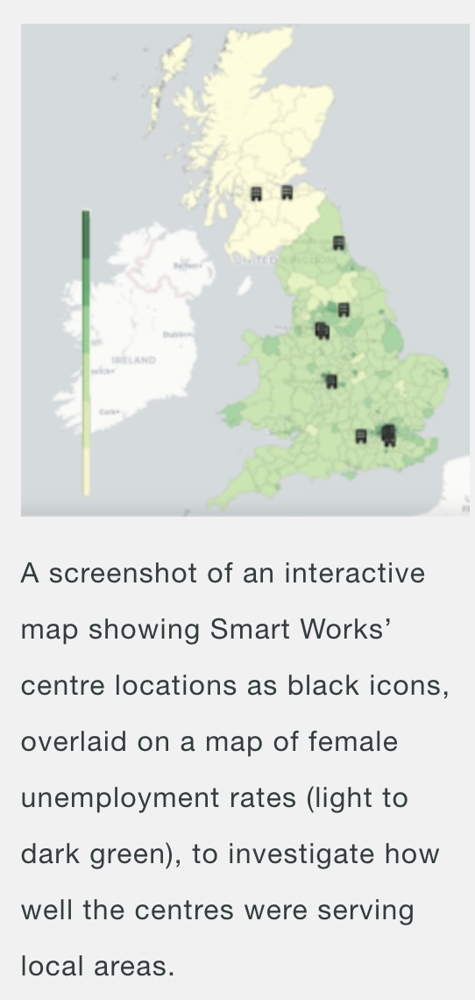
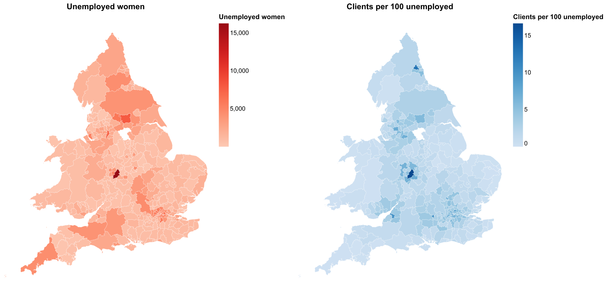
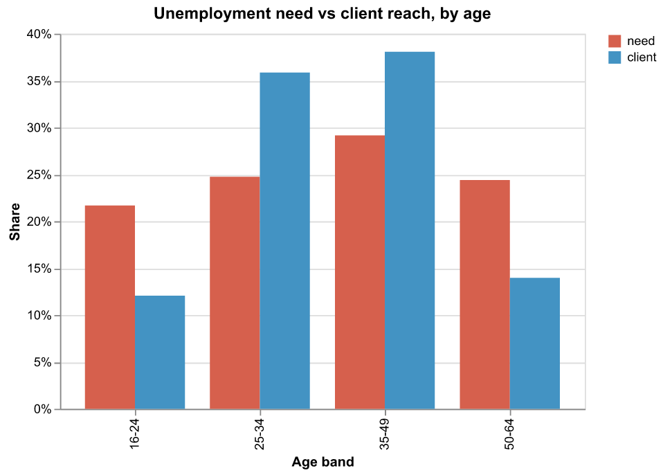

# Smart Works Woman Unemployment Analysis

**Reference article:** [DataKind UK - Smart Works](https://www.datakind.org.uk/stories-news/smart-works)

**More about what Smart Works is doing:** [Smart Works](https://www.smartworks.org.uk/)

## Problem Statement

Smart Works needed to identify gaps in their service provision and optimize their outreach strategy to reach more unemployed women who could benefit from their support.

**Key Challenge**: With over 632,500 unemployed women in their operating areas, Smart Works was not reaching all potential beneficiaries and struggled to identify service gaps.

**Key objectives:**
- Map the distribution of Smart Works clients across Local Authorities
- Identify areas with high unemployment but low client numbers
- Analyze demographic disparities between clients and national unemployment data
- Optimize outreach strategy and inform future center locations

**Research Questions:**
- Which Local Authorities have high unemployment rates but low Smart Works client numbers?
- Are there specific demographic groups (age, ethnicity) that Smart Works is under-serving?
- Where should Smart Works focus their efforts or consider opening new centers?
- How do Smart Works client demographics compare to national unemployment patterns?

## Dataset Involved

**Primary Data Sources**:
- **Census 2021**: Comprehensive demographic and employment data by Local Authority
- **Annual Population Survey**: Current unemployment statistics and trends
- **Smart Works Internal Data**: Client records with geographic and demographic information

**Data Integration**: Publicly available 'open data' from Census 2021 and Annual Population Survey was mapped to show women's unemployment rates by Local Authority and compared to Smart Works client distribution.

**Analysis Scope**:
- Geographic comparison of unemployment rates vs. client numbers
- Demographic analysis comparing Smart Works clients to overall unemployed women population

## Desired Output


*Figure 1: Geographic distribution of Smart Works clients compared to unemployment rates across Local Authorities*

**Key Findings:**

- **Service Gaps Identified**: Several Local Authorities with high unemployment rates showed low numbers of existing Smart Works clients
- **Demographic Disparity**: High unemployment among young women, who appear to be under-served by Smart Works
- **Strategic Opportunities**: Clear geographic areas where Smart Works could expand their reach
- **Outreach Optimization**: Evidence-based guidance for future center locations and targeted outreach

## Replicating the Output with KindTech

### Data Requirements

**Internal Dataset**: Smart Works client records with:
- Geographic location (Local Authority)
- Demographic information (age, ethnicity)
- Service usage patterns

**External Datasets**:
- **Census 2021**: Local Authority-level unemployment and demographic data
- **Annual Population Survey**: Current unemployment statistics
- **Local Authority Boundaries**: Geographic polygons for spatial analysis and mapping

### Analysis Workflow

1. **Data Collection**: Gather Smart Works center locations and client data by geography
2. **Data Integration**: Join internal data with census unemployment data by Local Authority
3. **Spatial Analysis**: Overlay client distribution with LAD boundary data to create UK-wide map
4. **Demographic Comparison**: Compare Smart Works client demographics to overall unemployed women population
5. **Gap Analysis**: Identify areas with high need but low service provision

### Reproduction

A runnable, end-to-end reproduction lives in
[`examples/smart_works_unemployment.py`](https://github.com/KindTechUK/kindtech/blob/main/examples/smart_works_unemployment.py)
(a [marimo](https://marimo.io/) notebook). It uses only the public KindTech
API plus a deterministic synthetic client list (the real client records are
private):

```python
from kindtech import geodata_to_properties, load_geodata, load_ons

# Female, unemployed, by age band, all LADs — Census 2021 table RM024
unemp = load_ons(
    "NM_2124_1",
    geography_type="LAD",
    time="latest",
    c2021_eastat_7=2,  # Unemployed
    c_sex=1,           # Female
    c2021_age_7=[2, 3, 4, 5],  # 16-24, 25-34, 35-49, 50-64
)

# LAD boundaries with centroids, normalised to share `geography_code`
geojson = load_geodata(geography_type="LAD", year="2025", boundary_type="BUC")
```

!!! note "Why Census 2021, not the Annual Population Survey?"
    APS unemployment *counts* by sex are suppressed for small samples — only
    ~40 of 350 Local Authorities return data, and age bands are sparser still.
    Census 2021 (table RM024, `NM_2124_1`) covers **every** LAD in England &
    Wales (318 areas, ~580,000 unemployed women), making it the reliable
    source for a choropleth.

Synthetic client numbers are modelled so reach **decays with distance** from
Smart Works' real centre cities (Birmingham, Manchester, Leeds, Newcastle,
Reading, Bristol, London, etc.), scaled by local female unemployment. This
deliberately reproduces the case study's structure: high-need areas far from
any centre end up under-served.

**Geographic gap** — female unemployment (the need) vs Smart Works reach
(clients per 100 unemployed women). Areas that are dark on the left but pale
on the right are the service gaps:


*Figure 2: Female unemployment by Local Authority (left) vs synthetic Smart
Works reach (right). The most under-served high-need areas — Cornwall,
Plymouth, the rural east, and coastal towns — sit far from any centre.*

**Demographic gap** — the age profile of unemployment (need) vs the age
profile of clients reached:


*Figure 3: The 16-24 band is ~22% of need but only ~12% of clients reached,
flagging young women as under-served — matching the original finding.*

To go from synthetic to real client data, swap `clients_total` for a
`postcode → LAD` aggregation of the real client list. The Census join, the
gap metric, and the maps stay identical.

## Lessons Learned

- **The right source matters more than the obvious one.** The original brief
  named the Annual Population Survey, but APS small-area suppression makes it
  unusable for a full LAD map — Census 2021 is the correct primary source.
- **Distance-decayed reach reproduces the real pattern.** Modelling client
  reach as a function of distance to the nearest centre surfaces exactly the
  high-need, low-provision areas the charity cared about.
- **Normalisation removes the busywork.** Because `load_ons` and
  `load_geodata` both expose `geography_code`, joining statistics to
  boundaries is a single `merge` — no manual column matching.
- **Per-need normalisation reveals gaps counts hide.** "Clients per 100
  unemployed women" exposes under-served areas that a raw client count would
  mask behind population size.
