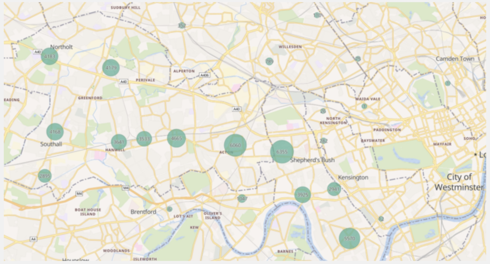

# Sobus BAME hospitalisation analysis

## Problem Statement

Sobus identified ongoing concerns about the disproportionate numbers of BAME (Black, Asian, and Minority Ethnic) people diagnosed with mental health conditions and under the care of mental health services, coupled with inadequate service provision to these communities.

**Key Challenge**: There was a lack of comprehensive local data mapping the BAME mental health landscape, making it difficult to understand the scope and nature of service gaps.

**Research Questions**:
- Was there a disproportionate representation of BAME people diagnosed and under the care of Mental Health Services?
- What was the current service provision for the BAME community suffering from mental health issues?
- How could data-driven insights inform more equitable mental health service delivery?

**Objective**: To map the BAME mental health landscape locally as a starting point for addressing service disparities and improving access to appropriate mental health support.

## Dataset Involved

The project successfully obtained data from multiple sources to provide a comprehensive view of mental health services in West London:

- **West London NHS Trust**: Main provider of mental health services across three boroughs (Hammersmith & Fulham, Ealing, and Hounslow)
- **Hammersmith & Fulham GP Federation**: Primary care data to understand community-level health patterns
- **LBH&F Social Care Data**: Local authority social care information
- **Sobus Sector Survey**: Primary research to capture community perspectives and service gaps

## Desired Output

*Figure 1: Distribution of mental health referrals by region in Hammersmith and Fulham*

**Key Findings**:

- **Disproportionate Representation**: BAME communities were overrepresented in mental health care, with rates 3-8 times higher than white equivalents across various diagnoses
- **Service Quality Gap**: The quality of health service support in the region was below the London average
- **Critical Self-Harm Rates**: Hammersmith & Fulham recorded the highest rate of BAME self-harm incidents in London

## Replicating the Output with KindTech

### Data Requirements

**Internal Dataset**: West London NHS Trust anonymised referral data broken down by ethnicity for Hammersmith and Fulham, with outcode (postcode prefix) attached to each referral for geographic analysis.

### Analysis Workflow

1. **Geographic Mapping**: Convert outcodes to LSOA (Lower Layer Super Output Area) codes
2. **Per-Capita Calculation**: Compute the number of referrals per capita for each LSOA
3. **Visualization**: Create geographic maps showing referral density and ethnic distribution patterns

## Lessons Learned
