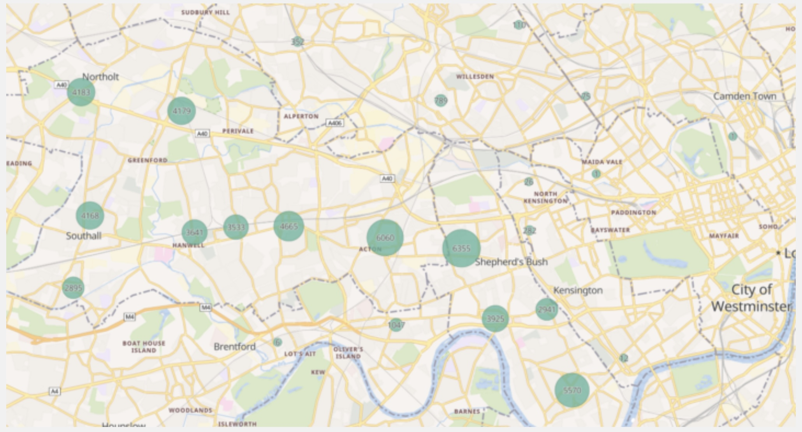
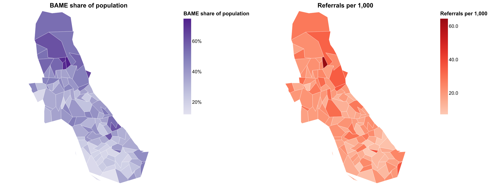
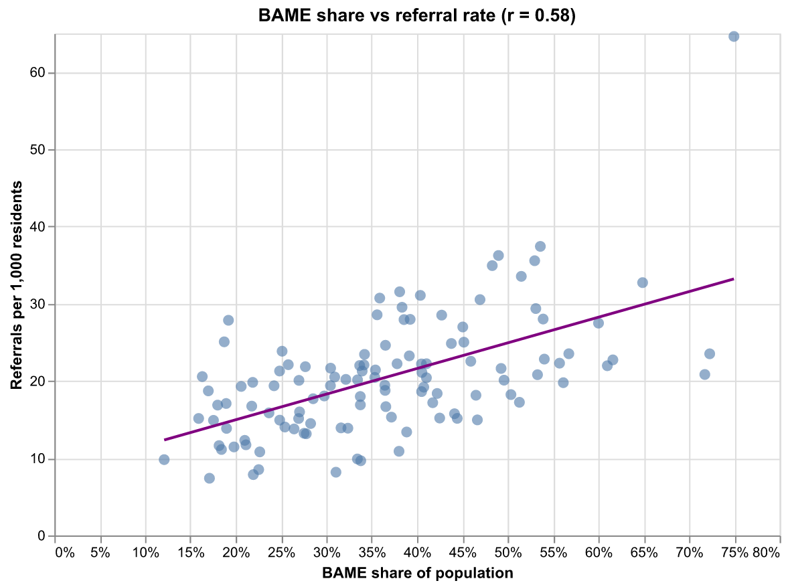

# Sobus BAME hospitalisation analysis

**Reference article:** [DataKind UK - Sobus](https://www.datakind.org.uk/stories-news/sobus)

**More about what Sobus is doing:** [Sobus](https://sobus.org.uk/)

## Problem Statement

Sobus identified ongoing concerns about the disproportionate numbers of BAME (Black, Asian, and Minority Ethnic) people diagnosed with mental health conditions and under the care of mental health services, coupled with inadequate service provision to these communities.

**Key Challenge**: There was a lack of comprehensive local data mapping the BAME mental health landscape, making it difficult to understand the scope and nature of service gaps.

**Research Questions**:
- Was there a disproportionate representation of BAME people diagnosed and under the care of Mental Health Services?
- What was the current service provision for the BAME community suffering from mental health issues?
- How could data-driven insights inform more equitable mental health service delivery?

**Objective**: To map the BAME mental health landscape locally as a starting point for addressing service disparities and improving access to appropriate mental health support.

## Dataset Involved

The project successfully obtained data from multiple sources to provide a comprehensive view of mental health services in West London:

- **West London NHS Trust**: Main provider of mental health services across three boroughs (Hammersmith & Fulham, Ealing, and Hounslow)
- **Hammersmith & Fulham GP Federation**: Primary care data to understand community-level health patterns
- **LBH&F Social Care Data**: Local authority social care information
- **Sobus Sector Survey**: Primary research to capture community perspectives and service gaps

## Desired Output


*Figure 1: Distribution of mental health referrals by region in Hammersmith and Fulham*

**Key Findings**:

- **Disproportionate Representation**: BAME communities were overrepresented in mental health care, with rates 3-8 times higher than white equivalents across various diagnoses
- **Service Quality Gap**: The quality of health service support in the region was below the London average
- **Critical Self-Harm Rates**: Hammersmith & Fulham recorded the highest rate of BAME self-harm incidents in London

## Replicating the Output with KindTech

### Data Requirements

**Internal Dataset**: West London NHS Trust anonymised referral data broken down by ethnicity for Hammersmith and Fulham, with outcode (postcode prefix) attached to each referral for geographic analysis.

### Analysis Workflow

1. **Geographic Mapping**: Convert outcodes to LSOA (Lower Layer Super Output Area) codes
2. **Per-Capita Calculation**: Compute the number of referrals per capita for each LSOA
3. **Visualization**: Create geographic maps showing referral density and ethnic distribution patterns

### Reproduction

A runnable, end-to-end reproduction lives in
[`examples/sobus_bame_referrals.py`](https://github.com/KindTechUK/kindtech/blob/main/examples/sobus_bame_referrals.py)
(a [marimo](https://marimo.io/) notebook). It chains three KindTech connectors,
all joining on the 2021 LSOA `geography_code`:

```python
from kindtech import outcode_to_geography, load_ons, load_geodata

# 1. A referral's outcode -> LSOA (the step real referral data would use)
outcode_to_geography(["W6", "W12", "W14"], geography_type="LSOA")

# 2. Ethnic composition per LSOA (Census 2021 TS021), restricted to the borough
eth = load_ons(
    "NM_2041_1",
    geography="1778385172TYPE151",  # LSOAs within Hammersmith & Fulham
    time="latest",
    c2021_eth_20=[0, 1004],  # Total, White -> BAME = Total - White
)
```

!!! note "Everything is on 2021 LSOAs — no crosswalk"
    The postcode connector returns 2021 LSOA codes, **Census 2021** is on 2021
    LSOAs (and gives the population denominator *and* the BAME share), and the
    default LSOA boundaries are 2021. So ethnicity, population and referral
    geography line up on one `geography_code` with no vintage conversion.

!!! warning "Outcode → LSOA is a rough, centroid-based stand-in"
    An outcode (e.g. `W6`) spans many LSOAs, so `outcode_to_geography` returns
    only the LSOA at its centroid — and a centroid can even fall in a
    neighbouring borough. With **full** postcodes use `postcodes_to_geography`
    for an exact mapping. The analysis below runs at true LSOA resolution from
    the census; the outcode step only demonstrates the mechanism.

Real NHS Trust referrals are confidential, so the notebook generates synthetic
referrals per LSOA at a rate that **rises with the area's BAME share**, and
models a BAME resident as more likely to be referred than a White resident —
reproducing the over-representation the study tested for.

**Where is the need?** — BAME share of population (left) and synthetic referral
rate (right). Shared dark areas mean referrals come from the most-BAME LSOAs:


*Figure 2: BAME share of population (left) vs synthetic mental-health referrals
per 1,000 residents (right) across Hammersmith & Fulham's 115 LSOAs. The
hotspots align.*

**Are BAME residents over-represented?** Each LSOA's BAME share against its
referral rate:


*Figure 3: A clear positive correlation between BAME share and referrals per
capita — the direction the original study found. Across the borough BAME
residents are ~37% of the population but a higher share of referrals.*

To run on real data, feed each referral's postcode through
`postcodes_to_geography(..., "LSOA")`, tag it with the patient's ethnicity, and
aggregate per `geography_code`; the census join, per-capita maths and maps are
unchanged.

## Lessons Learned

**Key takeaways and recommendations:**

- **Geography reveals disparity**: mapping referrals against ethnic composition
  at LSOA level exposes where need concentrates and quantifies
  over-representation — the starting point Sobus wanted for addressing service
  gaps.
- **Per-capita normalisation matters**: raw referral counts track population
  size; normalising by residents reveals true demand independent of how many
  people live in each area.
- **Postcode resolution drives accuracy**: full postcodes map cleanly to LSOAs;
  outcodes only approximate via a centroid and can cross borough boundaries, so
  the granularity of the source postcode caps the analysis.
- **Census is the denominator**: 2021 ethnic-group data on 2021 LSOAs joins
  natively to referral geography, no crosswalk needed.
