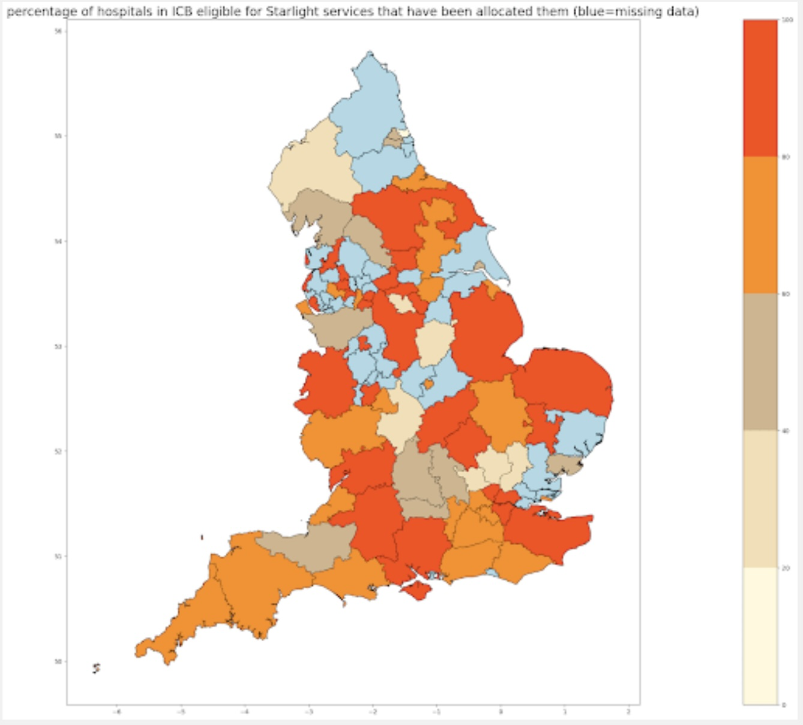

# Starlight mapping children's needs

**Reference article:** [DataKind UK - Starlight](https://www.datakind.org.uk/stories-news/starlight)

**More about what Starlight is doing:** [Starlight](https://www.starlight.org.uk/)

## Problem Statement

Starlight Children's Foundation needed to understand where there is overlap between their services, hospital play provision, and donors to make strategic decisions about service provision and fundraising efforts.

**Key objectives:**
- Map the distribution of Starlight services across the UK
- Identify gaps in play provision and service coverage
- Analyze disparities between different ethnicities and demographics
- Optimize resource allocation based on demonstrated need

**Research Questions:**
- Where are the gaps between Starlight's services and areas of greatest need?
- How does play provision vary across different regions and demographics?
- What factors influence the distribution of hospital play services?
- How can Starlight be more strategic in directing resources to areas with the greatest need?

## Dataset Involved

**Primary Data Collection**: Much of the data had to be collected through freedom of information (FOI) requests from 140 hospital trusts and health boards across the UK.

**Data Types Collected:**
- Number of child admissions by hospital
- Level of play provision and specialist staff
- Play budgets and resource allocation
- Geographic location of services

**Response Rate**: 87% of trusts responded, with some gaps in the data for those that did respond, suggesting that potentially useful data is not being systematically collected.

**Geospatial Processing**: Geographic data was processed and standardized to enable efficient map visualizations and spatial analysis.

## Desired Output

*Figure 1: Starlight heat map showing distribution of signed-up centres across the UK*

**Key Findings:**

- **Even Resource Distribution**: Starlight's resources were spread evenly over deprived and less deprived areas, indicating potential for more targeted allocation
- **Service Gaps Identified**: Some regions had more eligible trusts than were receiving play provisions
- **Admission vs. Service Mismatch**: Other regions had significantly more hospital admissions than boxes distributed
- **Strategic Opportunity**: Clear evidence that Starlight could be more strategic about directing help to places with the greatest need

## Replicating the Output with KindTech

### Data Requirements

**Synthetic Data Generation**: Create realistic datasets representing:
- Play provision levels across clinical commissioning groups (CCGs)
- Hospital admission rates for children
- Geographic distribution of Starlight services
- Demographic and deprivation indicators

**Geographic Boundaries**: Clinical commissioning group (CCG) boundaries for spatial analysis and mapping

### Analysis Workflow

1. **Data Generation**: Create synthetic play provision data across clinical regions
2. **Geographic Mapping**: Map data to relevant CCG boundaries for visualization
3. **Gap Analysis**: Identify areas with high need but low service provision
4. **Visualization**: Create heat maps showing service distribution and need indicators

## Lessons Learned

Key takeaways and recommendations.
