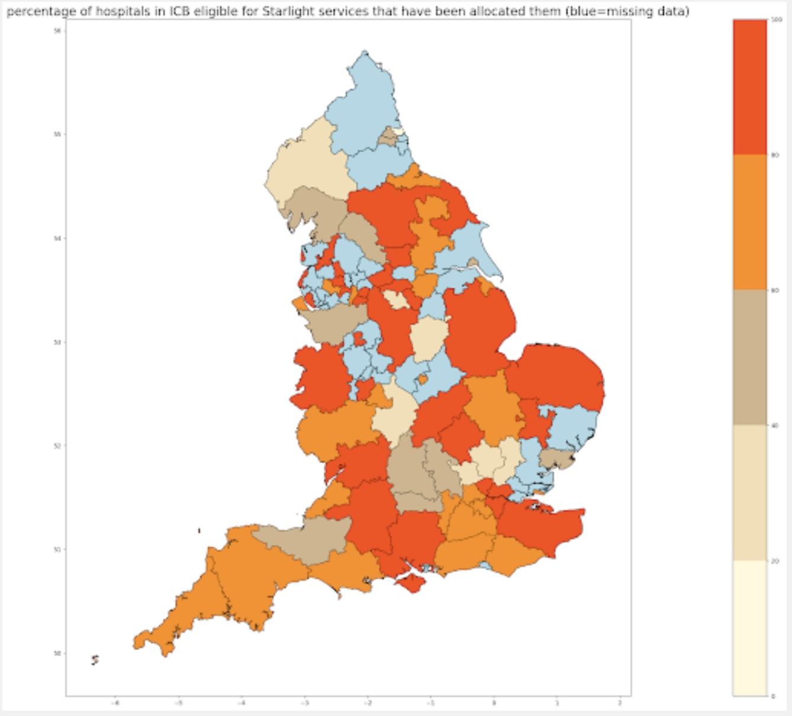
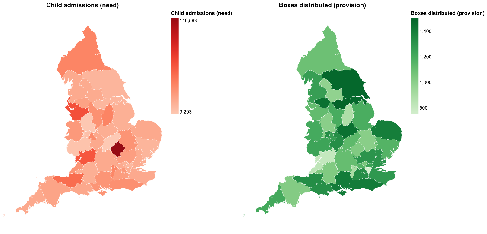
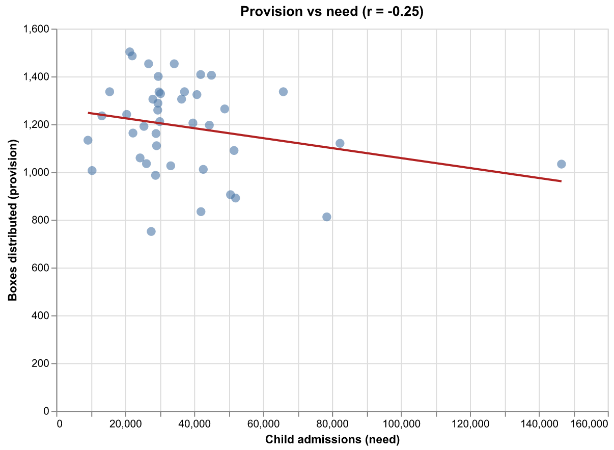

# Starlight mapping children's needs

**Reference article:** [DataKind UK - Starlight](https://www.datakind.org.uk/stories-news/starlight)

**More about what Starlight is doing:** [Starlight](https://www.starlight.org.uk/)

## Problem Statement

Starlight Children's Foundation needed to understand where there is overlap between their services, hospital play provision, and donors to make strategic decisions about service provision and fundraising efforts.

**Key objectives:**
- Map the distribution of Starlight services across the UK
- Identify gaps in play provision and service coverage
- Analyze disparities between different ethnicities and demographics
- Optimize resource allocation based on demonstrated need

**Research Questions:**
- Where are the gaps between Starlight's services and areas of greatest need?
- How does play provision vary across different regions and demographics?
- What factors influence the distribution of hospital play services?
- How can Starlight be more strategic in directing resources to areas with the greatest need?

## Dataset Involved

**Primary Data Collection**: Much of the data had to be collected through freedom of information (FOI) requests from 140 hospital trusts and health boards across the UK.

**Data Types Collected:**
- Number of child admissions by hospital
- Level of play provision and specialist staff
- Play budgets and resource allocation
- Geographic location of services

**Response Rate**: 87% of trusts responded, with some gaps in the data for those that did respond, suggesting that potentially useful data is not being systematically collected.

**Geospatial Processing**: Geographic data was processed and standardized to enable efficient map visualizations and spatial analysis.

## Desired Output


*Figure 1: Starlight heat map showing distribution of signed-up centres across the UK*

**Key Findings:**

- **Even Resource Distribution**: Starlight's resources were spread evenly over deprived and less deprived areas, indicating potential for more targeted allocation
- **Service Gaps Identified**: Some regions had more eligible trusts than were receiving play provisions
- **Admission vs. Service Mismatch**: Other regions had significantly more hospital admissions than boxes distributed
- **Strategic Opportunity**: Clear evidence that Starlight could be more strategic about directing help to places with the greatest need

## Replicating the Output with KindTech

### Data Requirements

**Synthetic Data Generation**: Create realistic datasets representing:
- Play provision levels across clinical commissioning groups (CCGs)
- Hospital admission rates for children
- Geographic distribution of Starlight services
- Demographic and deprivation indicators

**Geographic Boundaries**: Clinical commissioning group (CCG) boundaries for spatial analysis and mapping

### Analysis Workflow

1. **Data Generation**: Create synthetic play provision data across clinical regions
2. **Geographic Mapping**: Map data to relevant CCG boundaries for visualization
3. **Gap Analysis**: Identify areas with high need but low service provision
4. **Visualization**: Create heat maps showing service distribution and need indicators

### Reproduction

A runnable, end-to-end reproduction lives in
[`examples/starlight_play_provision.py`](https://github.com/KindTechUK/kindtech/blob/main/examples/starlight_play_provision.py)
(a [marimo](https://marimo.io/) notebook). It maps synthetic provision against
need over England's real NHS commissioning geography:

```python
from kindtech import load_geodata, geodata_to_properties
import pandas as pd

# England's 42 Integrated Care Boards (the geography that replaced CCGs)
geojson = load_geodata(geography_type="ICB", year="2023", coverage="EN", boundary_type="BSC")
icbs = pd.DataFrame(geodata_to_properties(geojson, "ICB", 2023))
```

!!! note "ICBs, not CCGs"
    Clinical Commissioning Groups were abolished in July 2022 and replaced by
    **Integrated Care Boards**. KindTech serves the current ICB boundaries, so
    the reproduction uses the 42 ICBs as the commissioning unit; the workflow is
    identical to the original CCG analysis.

The original study's admission and provision figures came from FOI returns that
aren't public, so the notebook generates a deterministic stand-in (`rng(3)`)
where **child admissions vary widely** (the need) but **boxes are distributed
roughly evenly** (the resource) — the exact pattern the study flagged.

**Need vs provision** — child admissions (left) and boxes distributed (right).
The two maps *don't* share their dark areas, which is the point:


*Figure 2: Child admissions (left, the need) vs Starlight boxes distributed
(right, the resource) across England's 42 ICBs. Provision does not follow need.*

**Does provision follow need?** Each ICB's admissions against its boxes:


*Figure 3: A near-flat (slightly negative) relationship between need and
provision — resources are spread evenly regardless of demand, the
"be more strategic" opportunity the original study identified.*

To run on real data, replace the synthetic columns with Starlight's FOI returns
keyed by ICB (or by trust, then mapped to ICB); the boundary join, coverage
maths and maps are unchanged.

## Lessons Learned

**Key takeaways and recommendations:**

- **Map provision against need, not in isolation**: plotting boxes alongside
  admissions on the same geography immediately exposes the decoupling that a
  provision-only view hides.
- **Even distribution is a finding, not a default**: a near-flat
  need-vs-provision relationship is itself the evidence that allocation could
  be more strategic.
- **Coverage ratios rank the opportunity**: boxes per 1,000 admissions turns
  the gap into an ordered list of where redirecting resource helps most.
- **Stable geography matters**: serving current ICB boundaries (post-CCG) keeps
  the analysis aligned with how the NHS commissions today, with no manual
  crosswalk.
